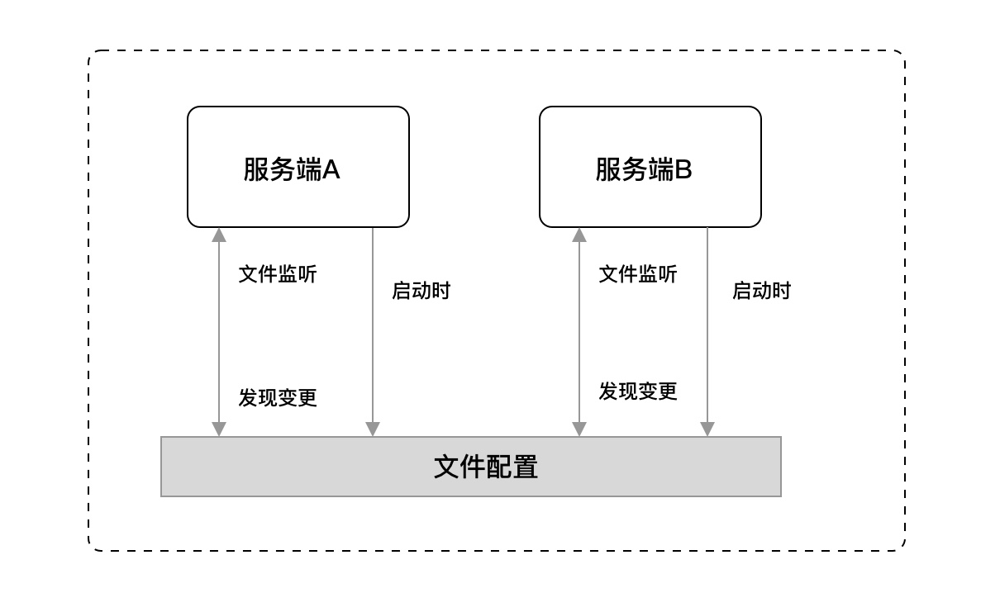

# blog_service
## go 注释规范
函数注释
```go
/*
   add 函数用于将两个整数相加
   参数：a - 第一个整数
         b - 第二个整数
   返回值：两个整数的和
   */
   func add(a, b int) int {
       return a + b
   }
```
包注释
```go
/*
   package_name 包提供了一些有用的函数和工具
   这个包可以用来处理字符串、日期等操作
   使用方法：import "package_name"
   */
   package package_name
```

## 建表，model，
## 路由管理
在 RESTful API 中 HTTP 方法对应的行为动作分别如下：
GET：读取/检索动作。
POST：新增/新建动作。
PUT：更新动作，用于更新一个完整的资源，要求为幂等。
PATCH：更新动作，用于更新某一个资源的一个组成部分，也就是只需要更新该资源的某一项，就应该使用 PATCH 而不是 PUT，可以不幂等。
DELETE：删除动作。


2.2.4.1 标签管理
功能	HTTP 方法	路径
新增标签	POST	/tags
删除指定标签	DELETE	/tags/:id
更新指定标签	PUT	/tags/:id
获取标签列表	GET	/tags

2.2.4.2 文章管理
功能	HTTP 方法	路径
新增文章	POST	/articles
删除指定文章	DELETE	/articles/:id
更新指定文章	PUT	/articles/:id
获取指定文章	GET	/articles/:id
获取文章列表	GET	/articles

### 编写路由对应的处理程序
```go
type Tag struct {}

func NewTag() Tag {
	return Tag{}
}
func (t Tag) Get(c *gin.Context) {}
func (t Tag) List(c *gin.Context) {}
func (t Tag) Create(c *gin.Context) {}
func (t Tag) Update(c *gin.Context) {}
func (t Tag) Delete(c *gin.Context) {}

```

### 路由管理

```go
  article := v1.NewArticle()
  tag := v1.NewTag()
  apiv1 := r.Group("/api/v1")
  {
      apiv1.POST("/tags", tag.Create)
      apiv1.DELETE("/tags/:id", tag.Delete)
      apiv1.PUT("/tags/:id", tag.Update)
      apiv1.PATCH("/tags/:id/state", tag.Update)
      apiv1.GET("/tags", tag.List)

      apiv1.POST("/articles", article.Create)
      apiv1.DELETE("/articles/:id", article.Delete)
      apiv1.PUT("/articles/:id", article.Update)
      apiv1.PATCH("/articles/:id/state", article.Update)
      apiv1.GET("/articles/:id", article.Get)
      apiv1.GET("/articles", article.List)
  }
```


## 编写公共组件

### 错误标准化
#### 公共错误码
```go
var (
	Success                   = NewError(0, "成功")
	ServerError               = NewError(10000000, "服务内部错误")
	InvalidParams             = NewError(10000001, "入参错误")
	NotFound                  = NewError(10000002, "找不到")
	UnauthorizedAuthNotExist  = NewError(10000003, "鉴权失败，找不到对应的 AppKey 和 AppSecret")
	UnauthorizedTokenError    = NewError(10000004, "鉴权失败，Token 错误")
	UnauthorizedTokenTimeout  = NewError(10000005, "鉴权失败，Token 超时")
	UnauthorizedTokenGenerate = NewError(10000006, "鉴权失败，Token 生成失败")
	TooManyRequests           = NewError(10000007, "请求过多")
)
```

#### 错误处理
```go
type Error struct {
	code int `json:"code"`
	msg string `json:"msg"`
	details []string `json:"details"`
}

var codes = map[int]string{}

func NewError(code int, msg string) *Error {
	if _, ok := codes[code]; ok {
		panic(fmt.Sprintf("错误码 %d 已经存在，请更换一个", code))
	}
	codes[code] = msg
	return &Error{code: code, msg: msg}
}

func (e *Error) Error() string {
	return fmt.Sprintf("错误码：%d, 错误信息：%s", e.Code(), e.Msg())
}

func (e *Error) Code() int {
	return e.code
}

func (e *Error) Msg() string {
	return e.msg
}

func (e *Error) Msgf(args []interface{}) string {
	return fmt.Sprintf(e.msg, args...)
}

func (e *Error) Details() []string {
	return e.details
}

func (e *Error) WithDetails(details ...string) *Error {
	newError := *e
	newError.details = []string{}
	for _, d := range details {
		newError.details = append(newError.details, d)
	}

	return &newError
}

func (e *Error) StatusCode() int {
	switch e.Code() {
	case Success.Code():
		return http.StatusOK
	case ServerError.Code():
		return http.StatusInternalServerError
	case InvalidParams.Code():
		return http.StatusBadRequest
	case UnauthorizedAuthNotExist.Code():
		fallthrough
	case UnauthorizedTokenError.Code():
		fallthrough
	case UnauthorizedTokenGenerate.Code():
		fallthrough
	case UnauthorizedTokenTimeout.Code():
		return http.StatusUnauthorized
	case TooManyRequests.Code():
		return http.StatusTooManyRequests
	}

	return http.StatusInternalServerError
}
```

### 配置管理
在应用程序的运行生命周期中，最直接的关系之一就是应用的配置读取和更新。它的一举一动都有可能影响应用程序的改变，其分别包含如下行为：

- 在启动时：可以进行一些基础应用属性、连接第三方实例（MySQL、NoSQL）等等的初始化行为。
- 在运行中：可以监听文件或其他存储载体的变更来实现热更新配置的效果，例如：在发现有变更的话，就对原有配置值进行修改，以此达到相关联的一个效果。如果更深入业务使用的话，我们还可以通过配置的热更新，达到功能灰度的效果，这也是一个比较常见的场景。
另外，配置组件是会根据实际情况去选型的，一般大多为文件配置或配置中心的模式，在本次博客后端中我们的配置管理使用最常见的文件配置作为我们的选型。


#### 三方开源库 viper
```shell
$ go get -u github.com/spf13/viper
```

### 数据库连接
### 日志写入
### 响应处理

