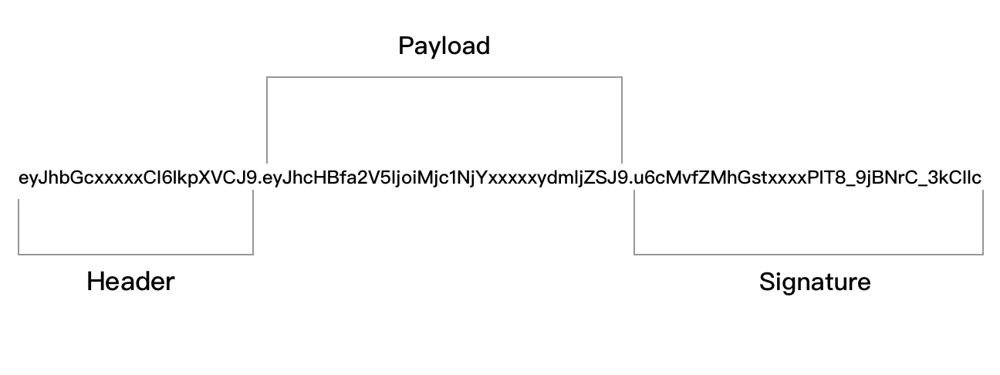

### API 接口进行访问控制。

两种 API 访问控制方案，分别是 OAuth 2.0 和 JWT，
- OAuth 2.0：本质上是一个授权的行业标准协议，提供了一整套的授权机制的指导标准，常用于使用第三方登陆的情况，像是你在网站登录时，会有提供其它第三方站点（例如用微信、QQ、Github 账号）关联登陆的，往往就是用 OAuth 2.0 的标准去实现的。并且 OAuth 2.0 会相对重一些，常常还会授予第三方应用去获取到我们对应账号的个人基本信息等等。 
- JWT：与 OAuth 2.0 完全不同，它常用于前后端分离的情况，能够非常便捷的给 API 接口提供安全鉴权，因此在本章节我们采用的就是 JWT 的方式，来实现我们的 API 访问控制功能。

### JWT 是什么
JSON Web 令牌（JWT）是一个开放标准（RFC7519），它定义了一种紧凑且自包含的方式，用于在各方之间作为 JSON 对象安全地传输信息。 由于此信息是经过数字签名的，因此可以被验证和信任。 可以使用使用 RSA 或 ECDSA 的公用/专用密钥对对 JWT 进行签名，其格式如下：



JSON Web 令牌（JWT）是由紧凑的形式三部分组成，这些部分由点 “.“ 分隔，组成为 ”xxxxx.yyyyy.zzzzz“ 的格式，三个部分分别代表的意义如下：

- Header：头部。
- Payload：有效载荷。
- Signature：签名。

WT 的使用场景
通常会先在内部约定好 JWT 令牌的交流方式，像是存储在 Header、Query Param、Cookie、Session 都有，但最常见的是存储在 Header 中。然后服务端提供一个获取 JWT 令牌的接口方法，返回而客户端去使用，在客户端请求其余的接口时需要带上所签发的 JWT 令牌，然后服务端接口也会到约定位置上获取 JWT 令牌来进行鉴权处理，以此流程来鉴定是否合法。

安装

```shell
go get -u github.com/golang-jwt/jwt/v5
```
### 创建认证表

```sql
CREATE TABLE `blog_auth` (
  `id` int(10) unsigned NOT NULL AUTO_INCREMENT,
  `app_key` varchar(20) DEFAULT '' COMMENT 'Key',
  `app_secret` varchar(50) DEFAULT '' COMMENT 'Secret',
  # 此处请写入公共字段
  PRIMARY KEY (`id`) USING BTREE
) ENGINE=InnoDB DEFAULT CHARSET=utf8mb4 COMMENT='认证管理';
```